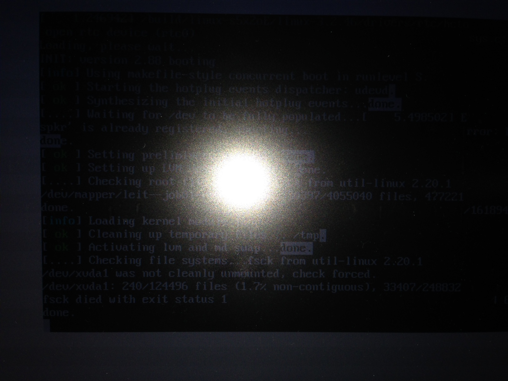

#Open Source

Hér á að koma listi af hópmeðlimum (sjá Markdown leiðbeiningar um það hvernig búa á til lista).

* Ásgeir Halldórsson

## 1. Linux uppsetning

Lýsið hvernig gekk að setja upp Linux (Ubuntu eða aðra útgáfu). Bætið inn í þetta skjal ljósmynd af tölvunni að ræsa Linux (skoðið hvernig myndir eru settar inn í Markdown skjöl).

Það var lítið mál að setja upp linux notaði Debian þar sem ég þekki það vel

## 2. Uppsetning á vim && git

Lýsið hvernig gekk að setja upp þessi tól.

Það er líka ekki mikið mál að setja upp vim og git með apititue

## 3. Unnið með Git (1. hluti)

Lýsið hvernig gekk að forka NIM verkefnið, og hvernig gekk að láta hópmeðlimi gera hver sína breytingu á kóðanum.

Það var ekki neitt mál að ýta á fork og þar sem ég nota git í vinnunni var ekki mikið mál að breyta coda

Látið fylgja tengil á ykkar útgáfu af verkefninu (Það á að sjálfsögðu að vera hægt að smella á tengilinn og fara þá beint í verkefnið ykkar!)
[GitHub clone af INTOPrufa](https://github.com/asgeirh/INTOPrufa)

## 4. Uppsettur hugbúnaður

Hér á að koma listi yfir opinn hugbúnað sem þið eruð með á vélunum nú þegar (sjá verkefnislýsingu).
* Pidgin (GNU GPL v2): [http://hg.pidgin.im/pidgin/main/](http://hg.pidgin.im/pidgin/main/)
* OpenVPN (GPL v2): [https://github.com/OpenVPN/openvpn](https://github.com/OpenVPN/openvpn)
* Seafile (GNU GPL v3): [https://github.com/haiwen/seafile](https://github.com/haiwen/seafile)

## 5. Unnið með Git (2. hluti)

Hér þarf ekkert að gera annað en að setja niðurstöður úr 4. fyrstu liðunum inn í þetta skjal.
